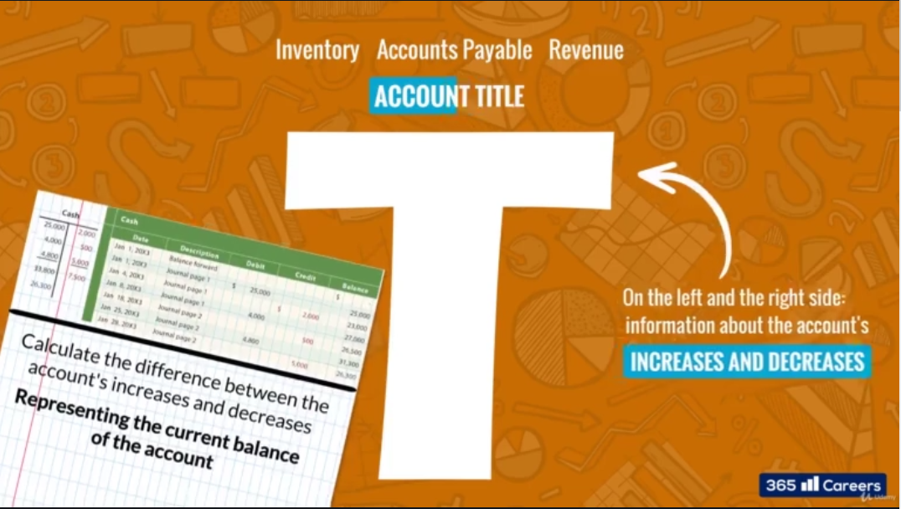
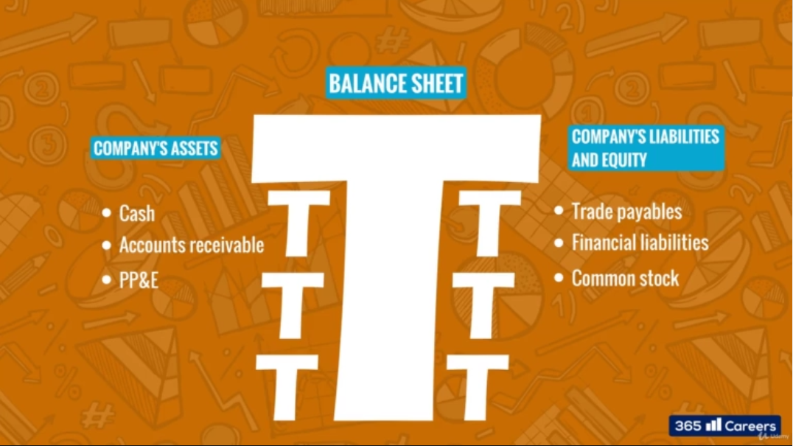
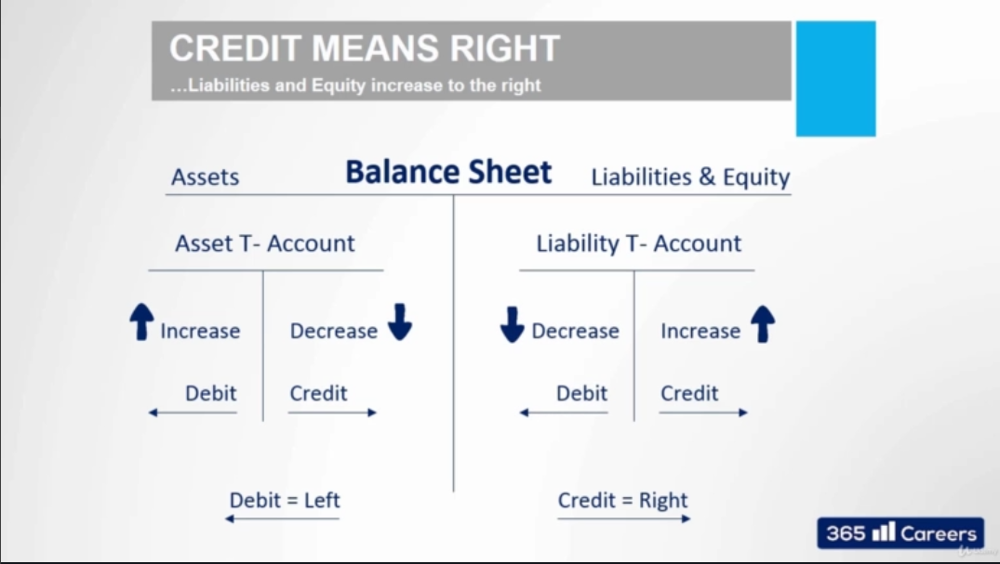

# T-Accounts
is one of the most important tool that accountants use when registering a transaction.
- Top side of T is "Account Title" like "Inventory, Accounts Payable, Revenue".
- On left side and right side: information about the account's Increases and Decreases
- When we draw a line below the T account, we can calculate the difference between the account's increases and decreases; representing the current balance of the account.

- Each statement can be considered as T Account with multiple T accounts below it. For example Balance sheet is one big T account, with left hand side having assets (and smaller T accounts specific to Cash, Accounts receivable, PP&E), and right hand side representing Company's Liabilities and Equity (and have smaller T accounts specific to Trade Payables, Financial Liabilities and Common Stock).

# Debits and Credits
- Debits on left side, and credits in right side
- Assets increase on left side, and decrease on right side
- Liabilities and Equity increases on the right side

# T account for Income Statements
One of the fundamental logic in accounting, when a firm makes profit, the profits remain with firms till it distributes them to shareholders. If it doesn't share them to shareholders, it retains them as equity (retained earnings) on its balance sheet.
- Debits are on the left side, and credits on the right side
- Revenues behave like Liabilities & Equity (Increase, go on right side)
- Cost behaves like Assets (Increase, go on left side)
