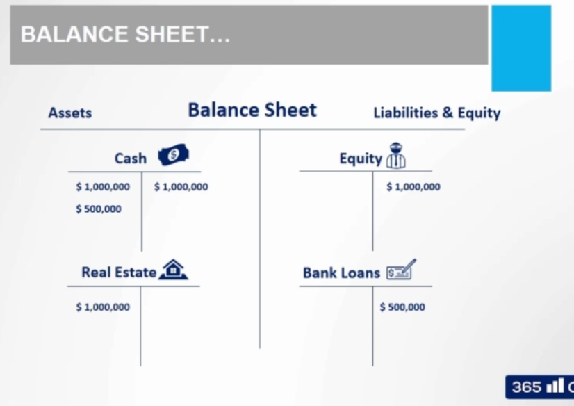

# Double-Entry Bookkeeping
- Every transaction has equal and opposite effects in Two or more accounts.
- This principle gurantees the satisfaction of the accounting equation.
- When registering accounting transactions, we need to think of at least two accounts that will be affected by the transaction.

### Example
Firm owns only 1 asset, 1 million dollars in cash. 100% Equity financed. Hence the balance sheet will look like:
- Assets: 1 Million
- Equity: 1 Million

Lets say the firm buys real estate asset. The account will now look like

Lets say the company obtains a bank loan for 0.5 Million USD

