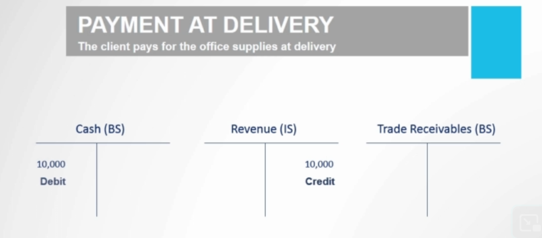
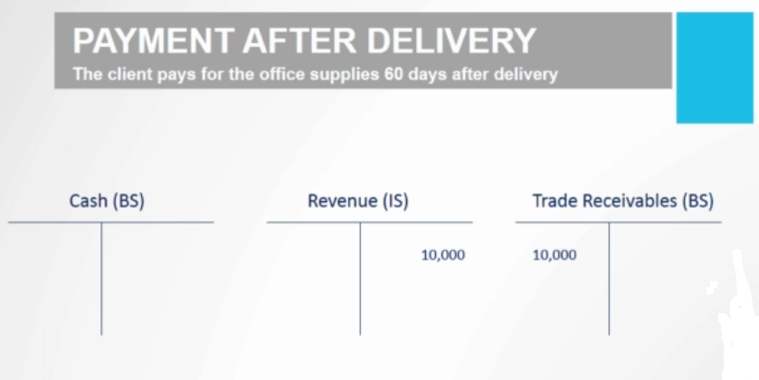
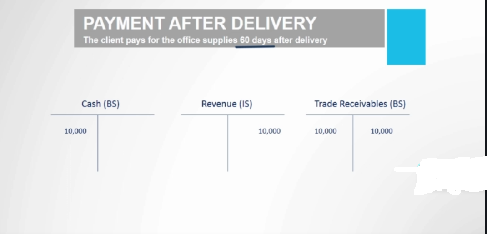
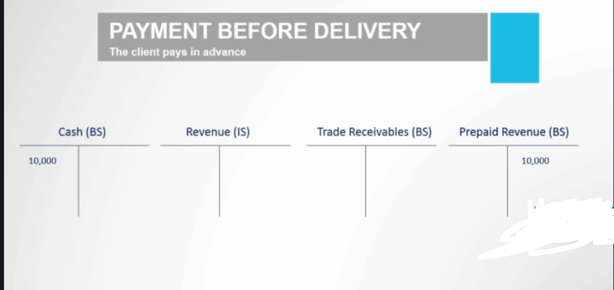
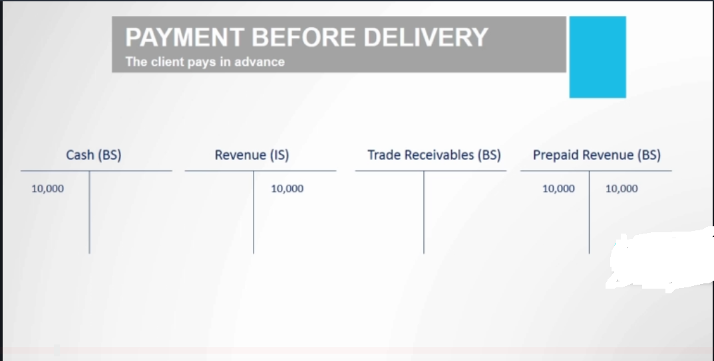

# Difference between Cash Flow and Profit
- A firm recognizes revenue when it is realized, when it is earned, no matter when it actually receive the payment. Hence Revenue and Cash at Hand can be different. 
- Cash can come before, at or after the sale of product
- Revenue only comes when a sale happens

Example:
A firm sells office equipment. It receives an order for $10,000 worth of products. The company delivers the product today. 
  - Revenue thus is earned today
  - Cash though could be:
    - A payment is made at delivery
    - A payment is made before delivery
    - A payment is made after delivery

## Case 1: Payment is made at delivery

## Case 2: Payment is made after delivery

When goods are delivered, the T accounts look like

When payment is actually made, the T accounts look like

## Case 3: Payment is made before delivery

When payment is made, the T accounts look like

When goods are actually delivered, the T accounts look like

