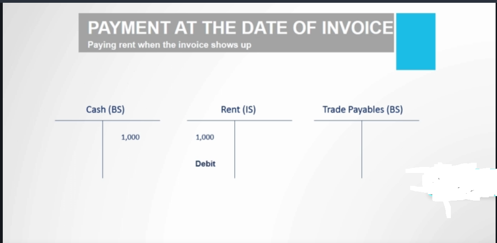

# Expenses and Cash Flow
- Similar to cash for sales, expenses payment can go out before, at or after the services/goods have been delivered.

Acompany pays rent of $1000

## Case 1: Expense and Payment happens at same time

## Case 2: Firm can delay the payment by 60 days
- Expense to be paid after 60 days

- Expense paid after 60 days

## Case 3: Firm has to pay rent before the Expense
- When firm pays the rent

After services were rendered

