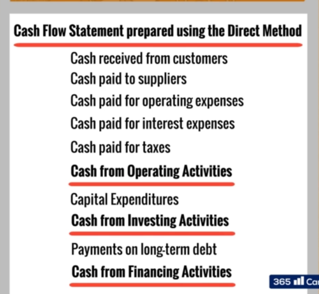

# Cash Flow Statement Presentations
- __Direct Method__
  - Shows all cash payments the firm has made throughout the period. This is also known as cash accounting. If all transactions are recognized when cash is paid, then Net Income would be equal to the firm's actual Cash Flow.
  - The difference between "Net Income and Cash Flow" is due to the __Accrual Principle__
  - Revenue is recognized when it is earned, not collected.
  - Costs are recognized when incurred, not paid
  - Under direct method, cash flow from Operating activities will include the things such as
    - Cash received from customers
    - Cash paid to suppliers

- __Indirect Method__
  - This mehtod is much more widely used than __Direct Method__.
  - Under Indirect Method, net income is converted to cash flow by making adjustments for transactions that have an impact on net income, but do not have an immediate cash effect. Such adjustments comprise
    - Elimination of non-cash expenses
    - Changes in Balance Sheet accounts deriving from the application of Accrual Accounting

  - Starting point for calculation of Indirect Cash Flow can be:
    - Net Income or EBITDA
    - If we start from EBITDA we don't have to worry about Non Cash Items

- Calculations for Indirect Cash FLow:
  - EBITDA: Earnings before Interests, Taxes, Depreciations, and Amortizations
  - Then calculate movement arising from three working capital components:
    - Change in Accounts Receivable
    - Change iN inventory
    - Change in Trade Payable
    - Change in Other Assets
    - Change in Other Liabilities

  - Sum of all above components, give us company's operating cash flow
  - Then calculate the cash flow from Investing Activities:
    - Investment in financial instruments or subsidiary companies
    - CAPEX will also be included here

  - Cash Flow from Financing Activities is sum of
    - Borrowings
    - Changes in Equity
    - (Cash Received from Issuing Stock + Cash Flow from the Repayment of Debt + Cash Flow from payment of Dividends)
    - Although Interest expenses are not included in this section of the Cash Flow statement. Interest expenses are part of a company's Cash Flow operating activies

