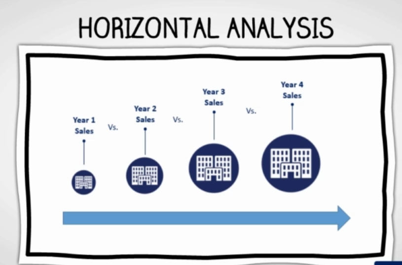
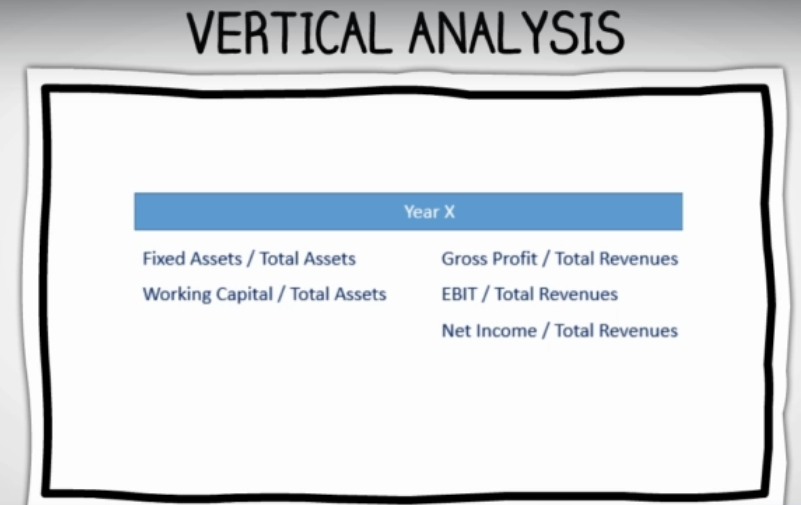

# Financial Statement Formats
There is no rule regulating how to organize financial statement formats. But is important to ensure consistent namings.

Two main type of Analysis
- __Horizontal Analysis:__ Understanding if numbers are unusually high or low compared to previous periods. For ex. we can calculate how much percentage revenue increased compared to last year. Horizontal analysis is also known as trend analysis, as it analyze development of number over a period of time

- __Vertical Analysis:__ involves number for the same time period. Each item is divided into specific base, which is 100% figure. In Balance sheet, this value is total value of assets and in income statement, it is total revenues figure. Once calculated, the comparison can be made across different time periods or with peers.

