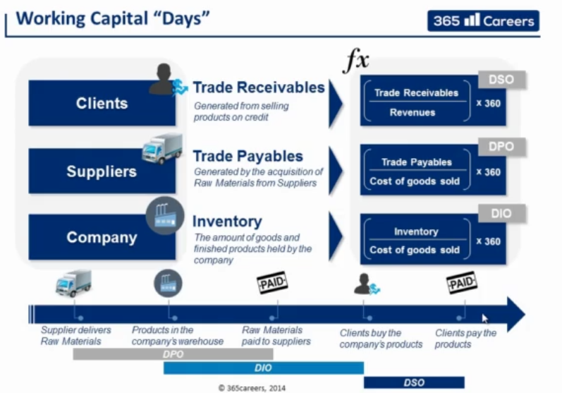

# Working Capital Days
Days calculation indicates, how many days are necessary in order to cash Trade Receivables, Trade Payables or days the item leaves the warehouse.

- __DSO:__ A low DSO number means a company needs less days in order to collect its trade receivables. A high __DSO__ number means a company is selling its product to its customers on credit, and taking longer to collect money.
- __DPO:__ Days Payable Outstanding, tells how many days does it take the company to pays its invoices from trade creditors such as suppliers.
- __DIO:__ Days Inventory Outstanding is measure of company's performance that tells how many days does it take the company to turn its inventory to sales.
